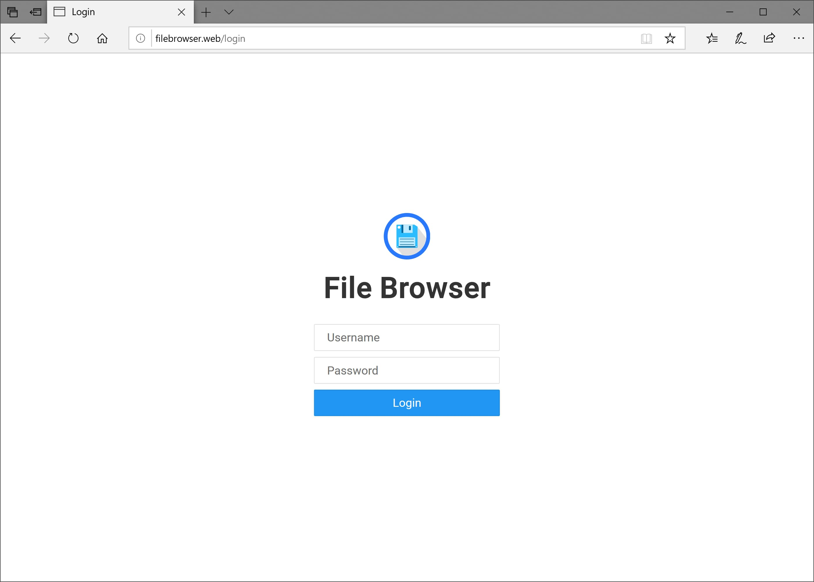
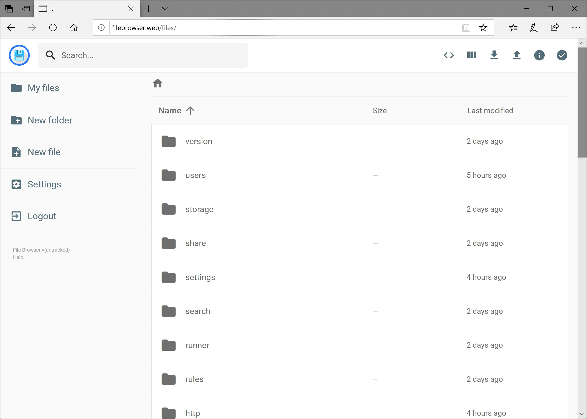
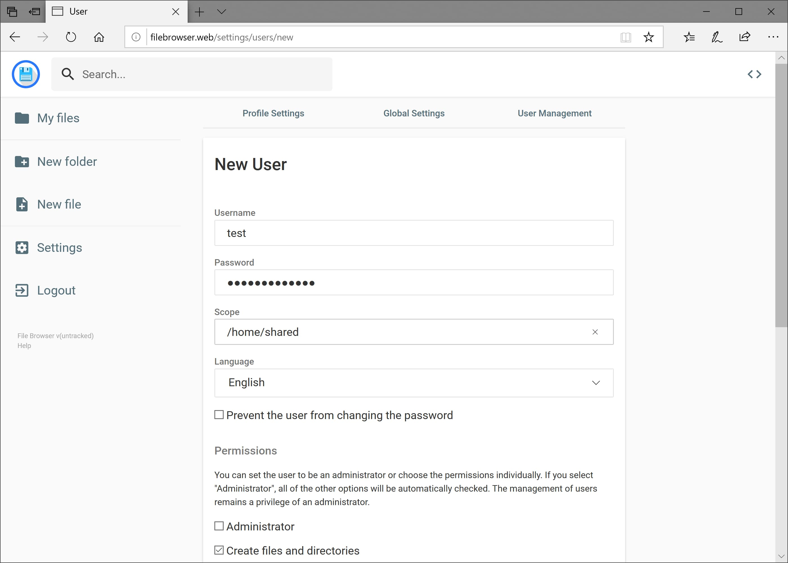
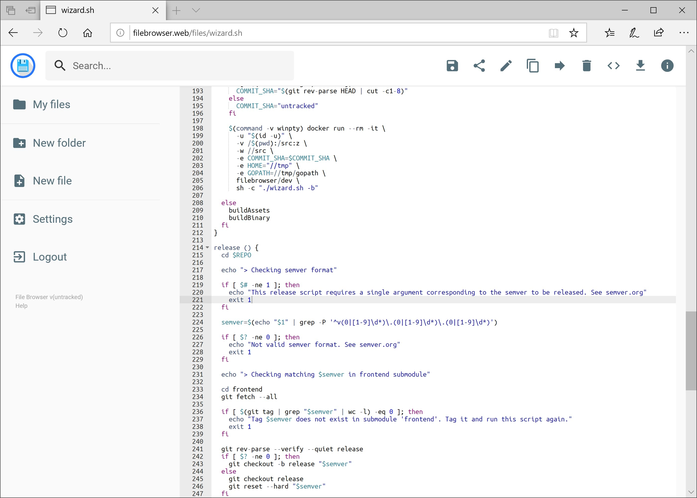
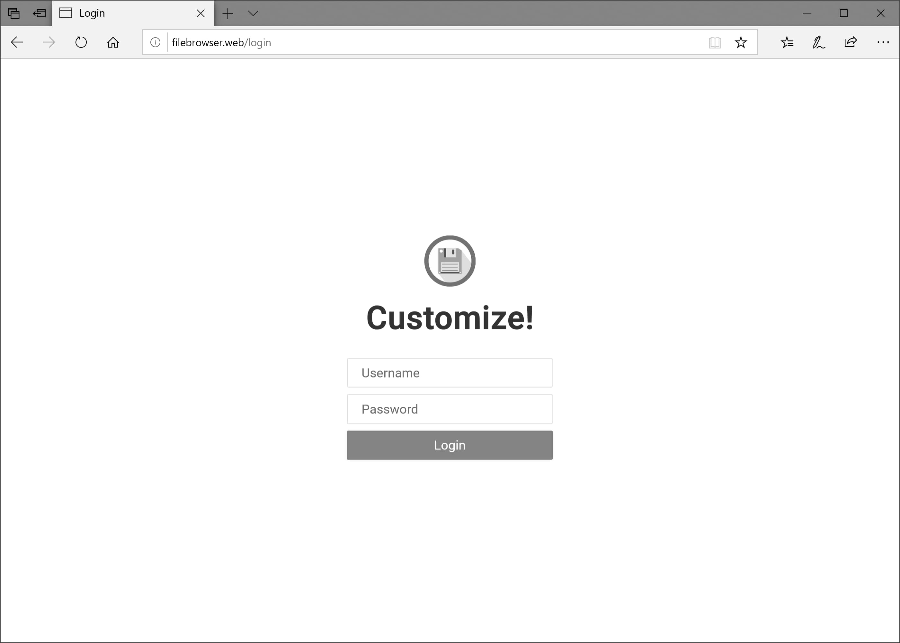

  

> [!WARNING]
>
> **File Browser is archived on 2026-09-01.** There will be no further releases and no security fixes. Existing releases and Docker images stay online. For the known unaddressed security issues and hardening guidance, read the [README](../README.md#security).

File Browser provides a file managing interface within a specified directory and it can be used to upload, delete, preview and edit your files. It is a **create-your-own-cloud**-kind of software where you can just install it on your server, direct it to a path and access your files through a nice web interface.

## Contents

- [Installation](installation.md)
- [Customization](customization.md)
- [Authentication](authentication.md)
- [Command Execution](command-execution.md)
- [Deployment](deployment.md)
- [Troubleshooting](troubleshooting.md)
- [Command Line Usage](cli/filebrowser.md)

Project-level documents live in the repository root: [README](../README.md), [Building File Browser](../CONTRIBUTING.md), [Security Policy](../SECURITY.md), [Code of Conduct](../CODE-OF-CONDUCT.md), [Changelog](../CHANGELOG.md) and [License](../LICENSE).

## Features

- **Easy Login System**

  

- **Sleek Interface**

  

- **User Management**

  

- **File Editing**

  

- **Custom Commands**

  

- **Customization**

  
