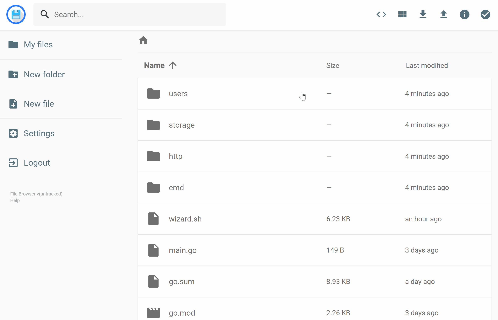
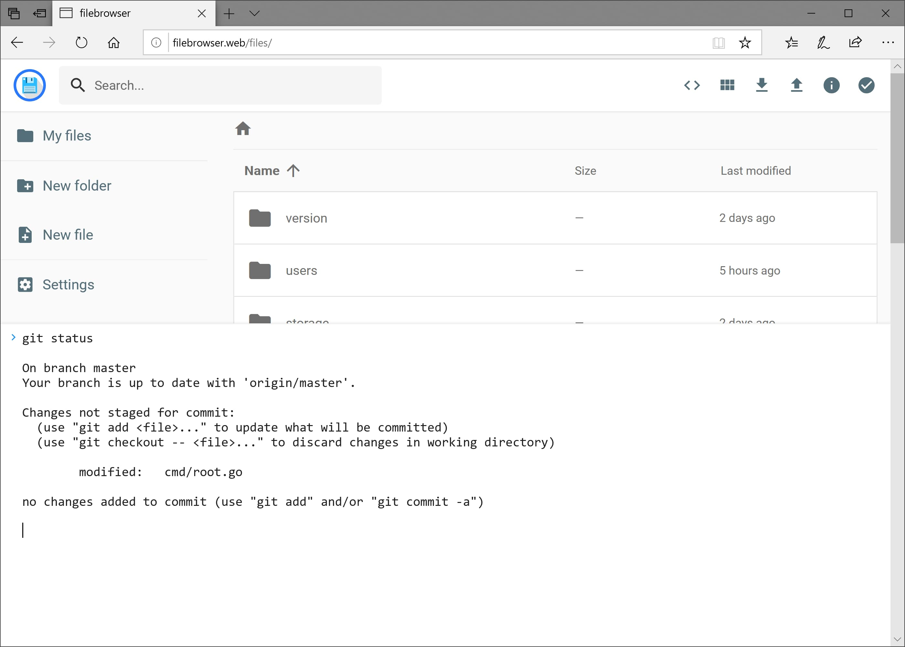

  

> [!WARNING]
>
> **File Browser is being archived on 2026-10-01.** There will be no further releases and no security fixes. Existing releases and Docker images stay online. For the project status, the known unfixed security issues, and hardening guidance, read the [README on GitHub](https://github.com/filebrowser/filebrowser#project-status).

File Browser provides a file managing interface within a specified directory and it can be used to upload, delete, preview and edit your files. It is a **create-your-own-cloud**-kind of software where you can just install it on your server, direct it to a path and access your files through a nice web interface.

## Features

-   **Easy Login System**

    ---

    

-   **Sleek Interface**

    ---

    

-   **User Management**

    ---

    

-   **File Editing**

    ---

    

-   **Custom Commands**

    ---

    

-   **Customization**

    ---

    

