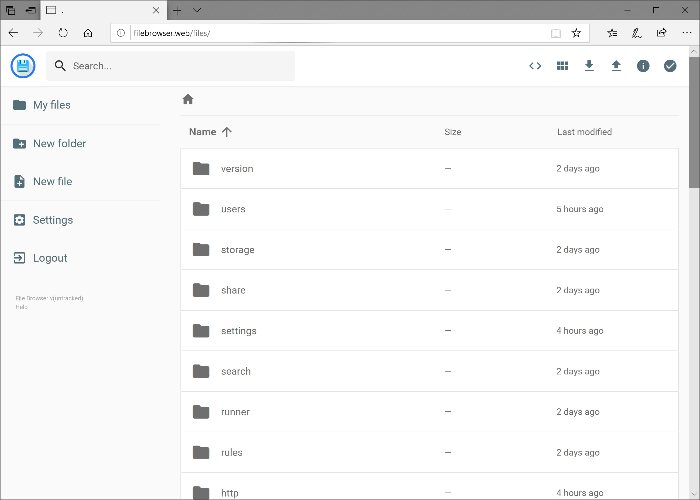
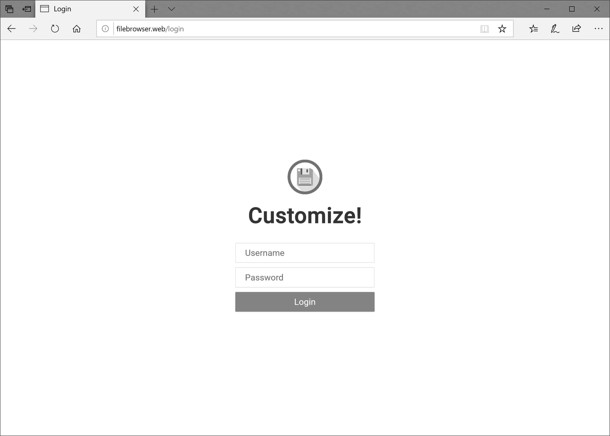

  

> [!WARNING]
>
> This project is currently on **maintenance-only** mode. For more information, read the information on [GitHub](https://github.com/filebrowser/filebrowser#project-status).

File Browser provides a file managing interface within a specified directory and it can be used to upload, delete, preview and edit your files. It is a **create-your-own-cloud**-kind of software where you can just install it on your server, direct it to a path and access your files through a nice web interface.

## Features

-   **Easy Login System**

    ---

    

-   **Sleek Interface**

    ---

    

-   **User Management**

    ---

    

-   **File Editing**

    ---

    

-   **Custom Commands**

    ---

    

-   **Customization**

    ---

    

